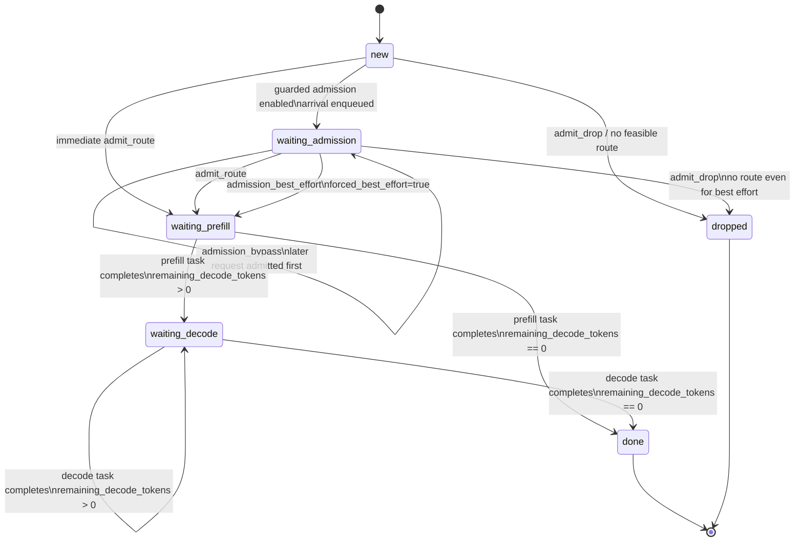
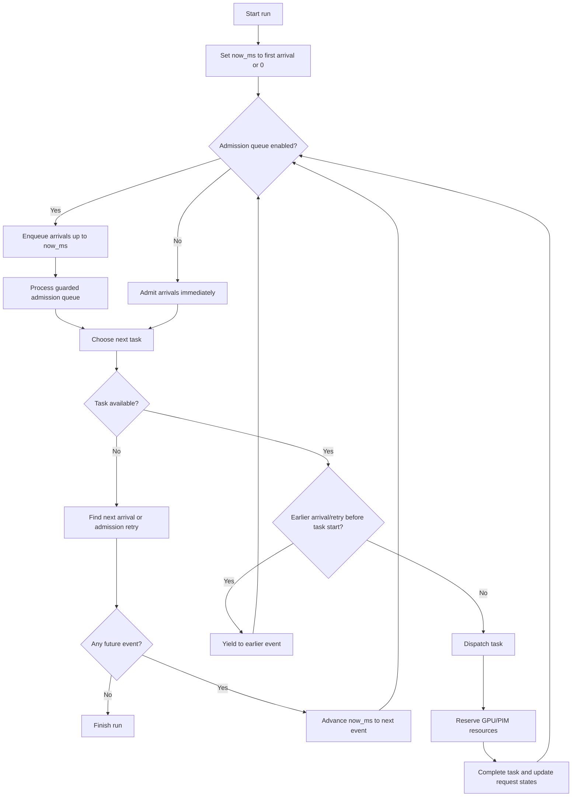
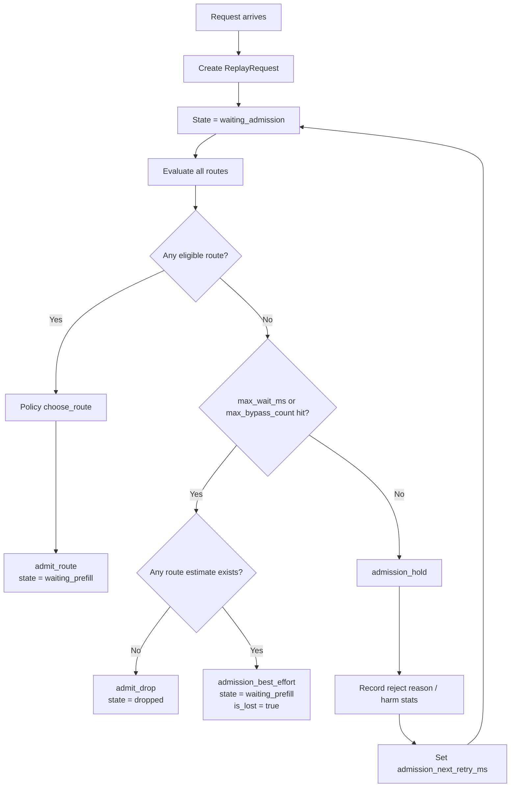
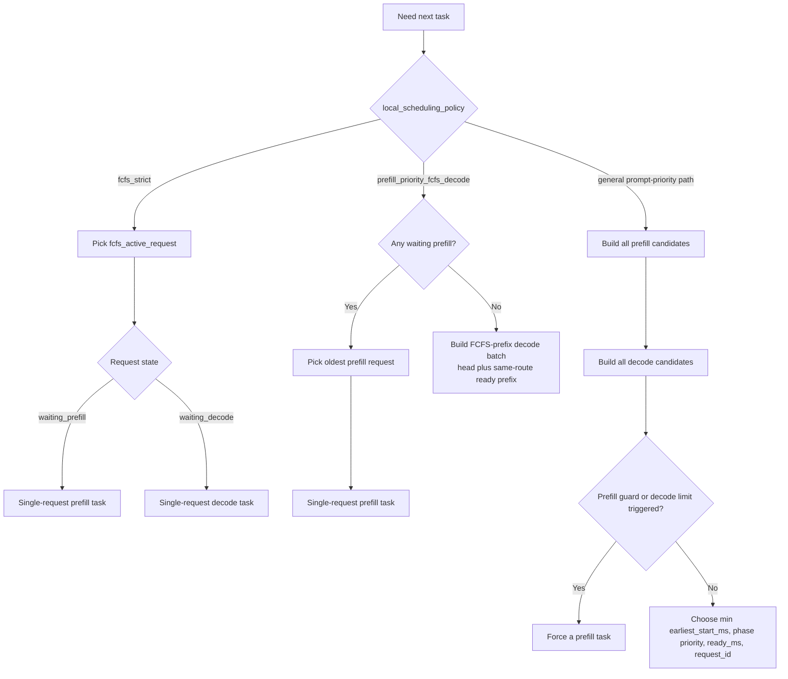
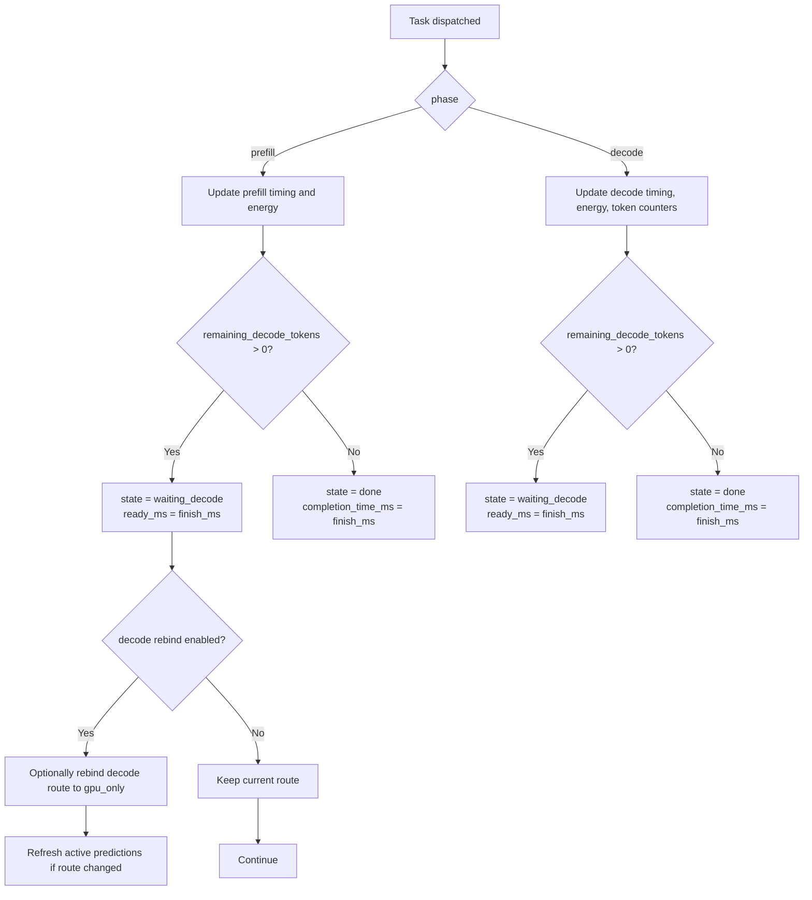
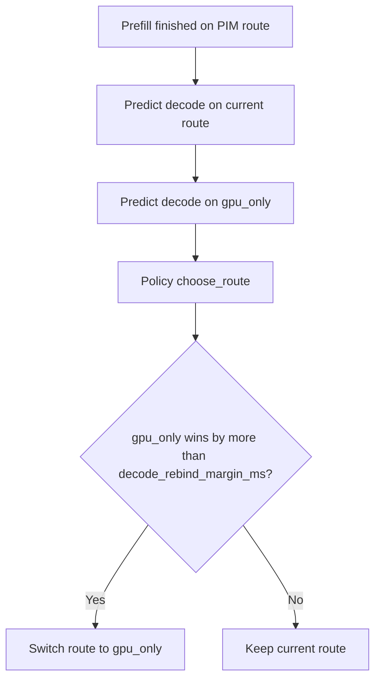

# Trace Replay Scheduler State Machine

This document describes the scheduler implemented in `src/trace_replay/`.

Primary code paths:
- `src/trace_replay/simulator.py`
- `src/trace_replay/admission.py`
- `src/trace_replay/tasks.py`
- `src/trace_replay/forecast.py`
- `src/trace_replay/types.py`

## Scope
This state machine describes the replay scheduler, not the DRAM frontend in `ramulator2/`.

One important detail: `ReplayRequest.state` only uses persistent request states:
- `new`
- `waiting_admission`
- `waiting_prefill`
- `waiting_decode`
- `done`
- `dropped`

The debug plots also show `running_prefill` and `running_decode`, but those are derived from `dispatch_task` / `complete_task` events. They are not stored as persistent request states.

## 1. Request Lifecycle

## 2. Top-Level Scheduler Loop

## 3. Guarded Admission Sub-State Machine

### Eligibility logic in guarded admission
A route candidate is admitted only if it passes the configured checks.

Current default behavior:
- self-SLO checks are optional and off by default
- harm-to-existing-request checks are the default gate

So the dominant question is:
- if this candidate is admitted now, do existing non-lost requests become infeasible?

If yes:
- hold in `waiting_admission`

If no:
- admit into `waiting_prefill`

## 4. Task Selection Policy State Machine

## 5. Task Completion State Machine

## 6. Decode Rebind (Optional)
Decode rebind is a small state machine nested inside the `waiting_prefill -> waiting_decode` transition.

It only runs when:
- `enable_decode_rebind = true`
- the request still has decode work left
- the current route uses PIM
- the request has not already started decode

## 7. Practical Interpretation
The scheduler is best understood as two coupled machines:

1. Admission machine
- decides when a request is allowed to enter service
- chooses its initial route
- may delay, bypass, force best-effort, or drop

2. Service machine
- runs admitted requests through prefill and decode
- selects the next executable task under the local scheduling policy
- updates resource availability and request completion state

That separation explains most behaviors seen in the debug plots:
- empty queue snapshots: service machine only, no admission queue
- many `admission_hold` / `admission_bypass` events: admission machine dominates
- `running_prefill` / `running_decode` bars: event-derived execution phases, not persistent request states
