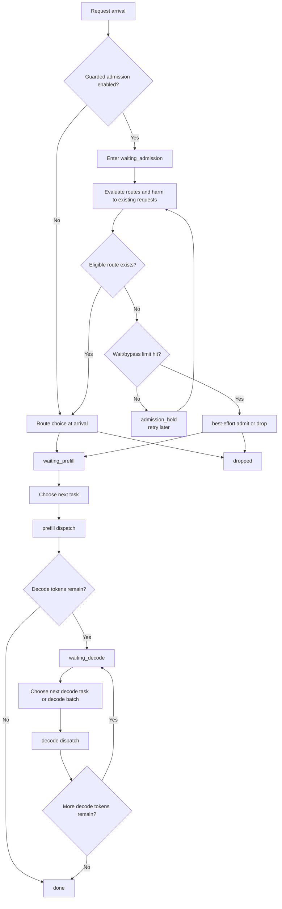

# Trace Replay Scheduler State Machine: Presentation Version

This is the compact, single-diagram version of the replay scheduler.

Primary implementation:
- `src/trace_replay/simulator.py`
- `src/trace_replay/admission.py`
- `src/trace_replay/tasks.py`
- `src/trace_replay/forecast.py`



## Exported Figures
- `docs/figures/trace_replay_scheduler_state_machine_presentation.svg`
- `docs/figures/trace_replay_scheduler_state_machine_presentation.png`

## Mermaid Source
- `docs/figures/trace_replay_scheduler_state_machine_presentation.mmd`

## Export Command
```bash
bash tools/export_scheduler_state_machine_figures.sh
```
