# Thesis Plotting Catalog

Publication-ready figures for the thesis. Generated by scripts in
[`scripts/`](scripts/), saved to [`figures/`](figures/) as PDF + PNG.
Cross-references back to [`docs/thesis_results_catalog.md`](../docs/thesis_results_catalog.md)
for the full experiment context.

| # | Thesis § | Figure | Script | PDF | PNG | Source |
|---|---|---|---|---|---|---|
| F1 | §6.5.0a | GPU-only vs hybrid — **thesis main claim (n=2k)** | [thesis_e5_gpu_vs_hybrid.py](scripts/thesis_e5_gpu_vs_hybrid.py) | [fig_e5_gpu_vs_hybrid.pdf](figures/fig_e5_gpu_vs_hybrid.pdf) | [.png](figures/fig_e5_gpu_vs_hybrid.png) | `cluster_outputs/.../e5_gpu_vs_hybrid_azure_20260528_152128/` |
| F1+ | §6.5.0a | GPU-only vs hybrid — **10× scale (n=19k Azure full)** | same | [fig_f_full19k_gpu_vs_hybrid.pdf](figures/fig_f_full19k_gpu_vs_hybrid.pdf) | [.png](figures/fig_f_full19k_gpu_vs_hybrid.png) | `cluster_outputs/.../f_full19k_azure_20260530_110944/` |
| F2 | §6.6 | bs throughput vs config (1/B disproved, bs=16 cliff) | [thesis_e6_bs_sweep.py](scripts/thesis_e6_bs_sweep.py) | [fig_e6_bs_throughput.pdf](figures/fig_e6_bs_throughput.pdf) | [.png](figures/fig_e6_bs_throughput.png) | `cluster_outputs/.../e6_bs_sweep_azure_20260528_201000/` |
| F3 | §6.6 | bs configured vs achieved (fill ratio) | same | [fig_e6_bs_actual_vs_cfg.pdf](figures/fig_e6_bs_actual_vs_cfg.pdf) | [.png](figures/fig_e6_bs_actual_vs_cfg.png) | same |
| F4 | §6.6 | bs per-cell histogram | same | [fig_e6_bs_histogram.pdf](figures/fig_e6_bs_histogram.pdf) | [.png](figures/fig_e6_bs_histogram.png) | same |
| F5 | §6.4 | E1 — architecture-driven routing divergence | [thesis_e1_route_share.py](scripts/thesis_e1_route_share.py) | [fig_e1_route_share.pdf](figures/fig_e1_route_share.pdf) | [.png](figures/fig_e1_route_share.png) | `cluster_outputs/.../e1_route_mix_20260519_214353/` |
| F6 | §3 | Roofline — Pi0 attention on A100 vs LPDDR5-PIM | [thesis_roofline.py](scripts/thesis_roofline.py) | [fig_roofline.pdf](figures/fig_roofline.pdf) | [.png](figures/fig_roofline.png) | `cluster_outputs/cost_tables_full_energy/` |
| F7 | §5 | Cost-model validation — HistGBR vs cost table | [thesis_predicted_vs_actual.py](scripts/thesis_predicted_vs_actual.py) | [fig_predicted_vs_actual.pdf](figures/fig_predicted_vs_actual.pdf) | [.png](figures/fig_predicted_vs_actual.png) | `cluster_outputs/cost_{models,tables}_full_energy_openvla/` |
| F8 | §6.2 | KV allocation policy comparison (gne / full / tail) | [thesis_kv_policy_compare.py](scripts/thesis_kv_policy_compare.py) | [fig_kv_policy_compare.pdf](figures/fig_kv_policy_compare.pdf) | [.png](figures/fig_kv_policy_compare.png) | `cluster_outputs/.../sweep_openvla_n2000_20260513_161108/` (slo=500) |
| F9 | §6.1 | Peak-RPS knee — all 3 datasets combined (log-log) | [thesis_rps_knee.py](scripts/thesis_rps_knee.py) | [fig_rps_knee.pdf](figures/fig_rps_knee.pdf) | [.png](figures/fig_rps_knee.png) | `cluster_outputs/.../rps_knee_pi0_20260529_224452/` |
| F9-lin | §6.1 | Peak-RPS knee — multi-panel linear-axes view (one panel per dataset) | same (`--linear`) | [fig_rps_knee_linear.pdf](figures/fig_rps_knee_linear.pdf) | [.png](figures/fig_rps_knee_linear.png) | same |
| F9a | §6.1 | Peak-RPS knee — VLA Poisson only (log-log) | same | [fig_rps_knee_vla_poisson.pdf](figures/fig_rps_knee_vla_poisson.pdf) | [.png](figures/fig_rps_knee_vla_poisson.png) | same |
| F9a-lin | §6.1 | Peak-RPS knee — VLA Poisson, linear axes | same (`--linear`) | [fig_rps_knee_vla_poisson_linear.pdf](figures/fig_rps_knee_vla_poisson_linear.pdf) | [.png](figures/fig_rps_knee_vla_poisson_linear.png) | same |
| F9b | §6.1 | Peak-RPS knee — Azure Poisson only (log-log) | same | [fig_rps_knee_azure_poisson.pdf](figures/fig_rps_knee_azure_poisson.pdf) | [.png](figures/fig_rps_knee_azure_poisson.png) | same |
| F9b-lin | §6.1 | Peak-RPS knee — Azure Poisson, linear axes | same (`--linear`) | [fig_rps_knee_azure_poisson_linear.pdf](figures/fig_rps_knee_azure_poisson_linear.pdf) | [.png](figures/fig_rps_knee_azure_poisson_linear.png) | same |
| F9c | §6.1 | Peak-RPS knee — Azure empirical only (log-log) | same | [fig_rps_knee_azure_empirical.pdf](figures/fig_rps_knee_azure_empirical.pdf) | [.png](figures/fig_rps_knee_azure_empirical.png) | same |
| F9c-lin | §6.1 | Peak-RPS knee — Azure empirical, linear axes | same (`--linear`) | [fig_rps_knee_azure_empirical_linear.pdf](figures/fig_rps_knee_azure_empirical_linear.pdf) | [.png](figures/fig_rps_knee_azure_empirical_linear.png) | same |
| F12a | §6.1 | RPS-over-time before vs after scaling — VLA | [thesis_rps_scale_to_peak.py](scripts/thesis_rps_scale_to_peak.py) | [fig_rps_scale_vla_poisson.pdf](figures/fig_rps_scale_vla_poisson.pdf) | [.png](figures/fig_rps_scale_vla_poisson.png) | `cluster_outputs/synthetic_v2/vla_poisson_n5000_seed0.csv` + a=20.1 |
| F12b | §6.1 | RPS-over-time before vs after scaling — Azure Poisson | same | [fig_rps_scale_azure_poisson.pdf](figures/fig_rps_scale_azure_poisson.pdf) | [.png](figures/fig_rps_scale_azure_poisson.png) | `cluster_outputs/synthetic_v2/azure_poisson_n5000_seed0.csv` + a=2.24 (knee) — currently rendered with placeholder 2.63 |
| F12c | §6.1 | RPS-over-time before vs after scaling — Azure empirical | same | [fig_rps_scale_azure_empirical.pdf](figures/fig_rps_scale_azure_empirical.pdf) | [.png](figures/fig_rps_scale_azure_empirical.png) | `cluster_outputs/synthetic_v2/azure_empirical_n5000_seed0.csv` + a=2.23 (knee) — currently rendered with placeholder 2.53 |
| F12d | §6.1 | RPS-over-time before vs after scaling — **real Azure 19k** | same | [fig_rps_scale_azure_full19k.pdf](figures/fig_rps_scale_azure_full19k.pdf) | [.png](figures/fig_rps_scale_azure_full19k.png) | `cluster_outputs/azure/AzureLLMInferenceTrace_conv.csv` + a≈2.5 (placeholder until full19k sweep) |
| F13a | §6.5 | Full-trace dashboard (ThrottLLM-style) — Pi0 hybrid, Azure 19k | [thesis_azure_dashboard.py](scripts/thesis_azure_dashboard.py) | [fig_azure_dashboard_f_pi0_hybrid.pdf](figures/fig_azure_dashboard_f_pi0_hybrid.pdf) | [.png](figures/fig_azure_dashboard_f_pi0_hybrid.png) | `f_full19k_azure_20260530_110944/01_pi0_hybrid/.../requests_out.csv` |
| F13b | §6.5 | Full-trace dashboard — Pi0 gpu-only, Azure 19k | same | [fig_azure_dashboard_f_pi0_gpuonly.pdf](figures/fig_azure_dashboard_f_pi0_gpuonly.pdf) | [.png](figures/fig_azure_dashboard_f_pi0_gpuonly.png) | `f_full19k_azure_20260530_110944/02_pi0_gpuonly/.../requests_out.csv` |
| F13c | §6.5 | Full-trace dashboard — OpenVLA hybrid, Azure 19k | same | [fig_azure_dashboard_f_openvla_hybrid.pdf](figures/fig_azure_dashboard_f_openvla_hybrid.pdf) | [.png](figures/fig_azure_dashboard_f_openvla_hybrid.png) | `f_full19k_azure_20260530_110944/03_openvla_hybrid/.../requests_out.csv` |
| F13d | §6.5 | Full-trace dashboard — OpenVLA gpu-only, Azure 19k | same | [fig_azure_dashboard_f_openvla_gpuonly.pdf](figures/fig_azure_dashboard_f_openvla_gpuonly.pdf) | [.png](figures/fig_azure_dashboard_f_openvla_gpuonly.png) | `f_full19k_azure_20260530_110944/04_openvla_gpuonly/.../requests_out.csv` |
| F10a | §6.1 | Trace timeline — Azure conv (real) | [thesis_trace_timeline.py](scripts/thesis_trace_timeline.py) | [fig_trace_timeline_azure.pdf](figures/fig_trace_timeline_azure.pdf) | [.png](figures/fig_trace_timeline_azure.png) | `cluster_outputs/azure/AzureLLMInferenceTrace_conv.csv` |
| F10b | §6.1 | Trace timeline — VLA synthetic (Poisson) | same | [fig_trace_timeline_vla_poisson.pdf](figures/fig_trace_timeline_vla_poisson.pdf) | [.png](figures/fig_trace_timeline_vla_poisson.png) | `cluster_outputs/synthetic_v2/vla_poisson_n5000_seed0.csv` |
| F10c | §6.1 | Trace timeline — Azure synthetic (Poisson) | same | [fig_trace_timeline_azure_poisson.pdf](figures/fig_trace_timeline_azure_poisson.pdf) | [.png](figures/fig_trace_timeline_azure_poisson.png) | `cluster_outputs/synthetic_v2/azure_poisson_n5000_seed0.csv` |
| F10d | §6.1 | Trace timeline — Azure synthetic (empirical CDF) | same | [fig_trace_timeline_azure_empirical.pdf](figures/fig_trace_timeline_azure_empirical.pdf) | [.png](figures/fig_trace_timeline_azure_empirical.png) | `cluster_outputs/synthetic_v2/azure_empirical_n5000_seed0.csv` |
| F11a | §6.1 | Shape timeline (Lin / Lout per request) — Azure real | [thesis_shape_timeline.py](scripts/thesis_shape_timeline.py) | [fig_shape_timeline_azure.pdf](figures/fig_shape_timeline_azure.pdf) | [.png](figures/fig_shape_timeline_azure.png) | `cluster_outputs/azure/AzureLLMInferenceTrace_conv.csv` |
| F11b | §6.1 | Shape timeline — VLA synthetic (Poisson) | same | [fig_shape_timeline_vla_poisson.pdf](figures/fig_shape_timeline_vla_poisson.pdf) | [.png](figures/fig_shape_timeline_vla_poisson.png) | `cluster_outputs/synthetic_v2/vla_poisson_n5000_seed0.csv` |
| F11c | §6.1 | Shape timeline — Azure synthetic (Poisson) | same | [fig_shape_timeline_azure_poisson.pdf](figures/fig_shape_timeline_azure_poisson.pdf) | [.png](figures/fig_shape_timeline_azure_poisson.png) | `cluster_outputs/synthetic_v2/azure_poisson_n5000_seed0.csv` |
| F11d | §6.1 | Shape timeline — Azure synthetic (empirical CDF) | same | [fig_shape_timeline_azure_empirical.pdf](figures/fig_shape_timeline_azure_empirical.pdf) | [.png](figures/fig_shape_timeline_azure_empirical.png) | `cluster_outputs/synthetic_v2/azure_empirical_n5000_seed0.csv` |

## Headline figure preview

### F1 — Thesis main claim (§6.5.0a, n=2k)
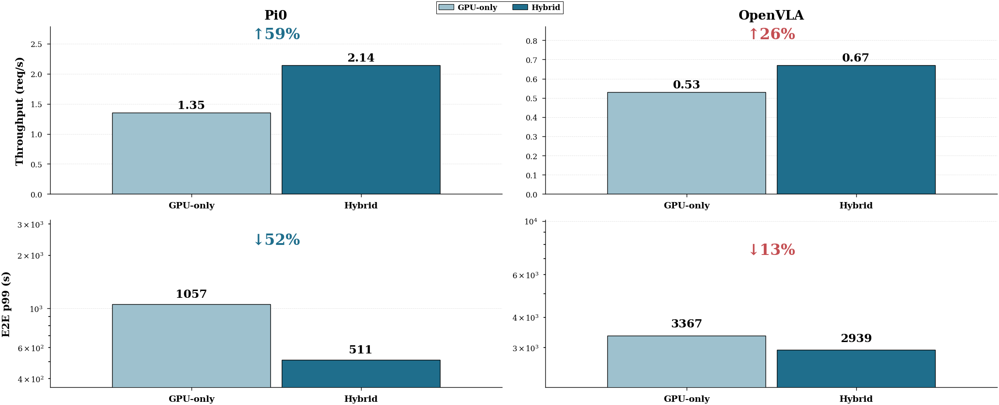

Both models, both metrics: **hybrid PIM+GPU beats GPU-only**. Pi0:
+59% throughput, −52% E2E p99. OpenVLA: +26% throughput,
−13% E2E p99. Azure conv at scale=1.0; saturation-dominated absolute
numbers — the relative comparison is what the thesis needs.

### F1+ — Thesis main claim at 10× scale (§6.5.0a, n=19k full Azure)
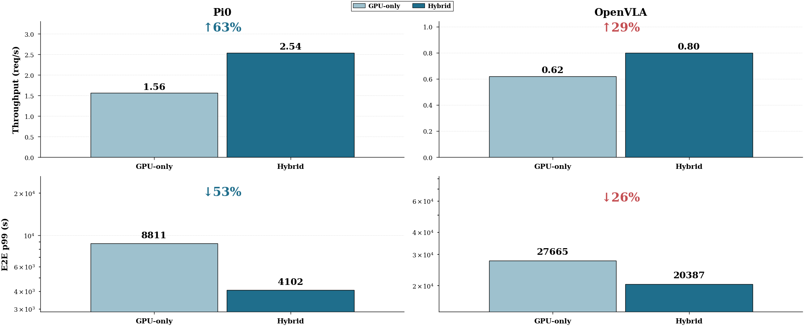

Direct apples-to-apples confirmation of F1 at the full 19,365-row
Azure conv trace. Same hybrid-wins-both-models pattern. **Pi0**: +63%
throughput, −53% E2E p99. **OpenVLA**: +29% throughput, **−26% E2E p99
(2× stronger than at n=2k)**.

The OpenVLA hybrid advantage *grew* with scale because GPU-only at 10×
the request density experiences more queueing pressure, amplifying
the relative benefit of PIM offload. Pi0's gap stayed roughly
constant because Pi0's per-request decode cost is already small and
queueing dynamics matter less.

Side-by-side:

| Metric | E5 v2 (n=2k) | F (n=19k) |
|---|---|---|
| Pi0 throughput gain | +59% | **+63%** |
| Pi0 E2E p99 reduction | −52% | **−53%** |
| OpenVLA throughput gain | +26% | **+29%** |
| OpenVLA E2E p99 reduction | −13% | **−26%** ← 2× stronger |

Route mix: 99.88% PIM for Pi0, 99.87% PIM for OpenVLA (same as E5 v2).
Wall time: 32k s for cell 01 (Pi0 hybrid, cold cache) → ~9h; the
other 3 cells were 1.5–4 h each (warm cache). All 4 cells finished
without intervention after the `--no-kv-timeline` flag landed.

### F2 — Batch size scaling (§6.6)
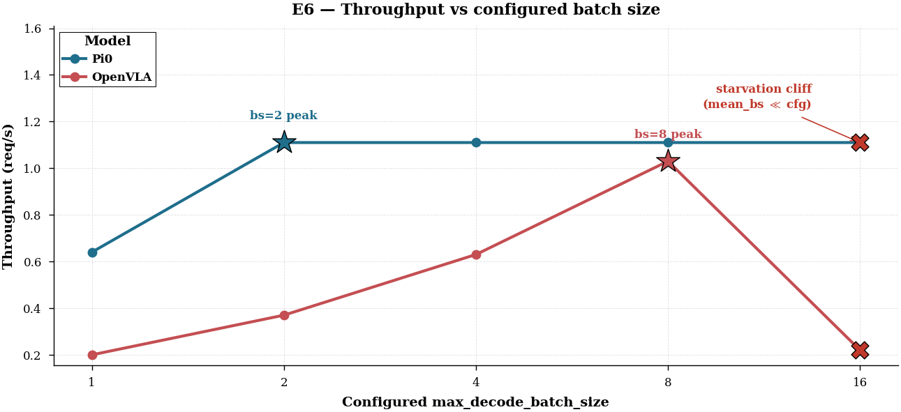

The "1/B regression" from earlier synthetic-VLA runs is **not real on
Azure conv**. Throughput scales 0.66→3.36 req/s for Pi0 (5.1×) and
0.21→1.11 for OpenVLA (5.3×) over bs=1→8. Then a starvation cliff at
bs=16: mean_bs collapses to 1.30 / 1.06 because the decode scheduler
can't fill cohorts of 16 at max_active=32.

### F2-knee — Same bs sweep at the knee
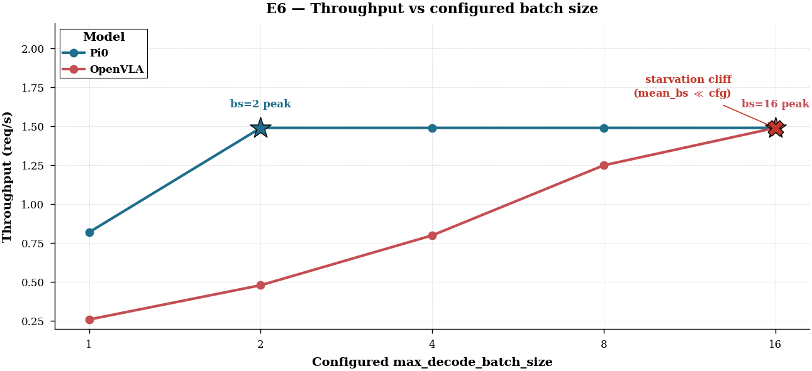

Re-run of F2 with `arrival_scale=3.75` (azure_poisson knee) instead of
deep saturation. Pi0 plateaus at bs=2; OpenVLA reaches bs=16 cleanly
(thru=1.49, mean_bs=9.31). The cliff at bs=16 vanishes. Source:
`j_knee_bs_azure_poisson_20260530_174904`.

### F2-cliff — bs=16 cliff: saturation vs knee  (NEW)
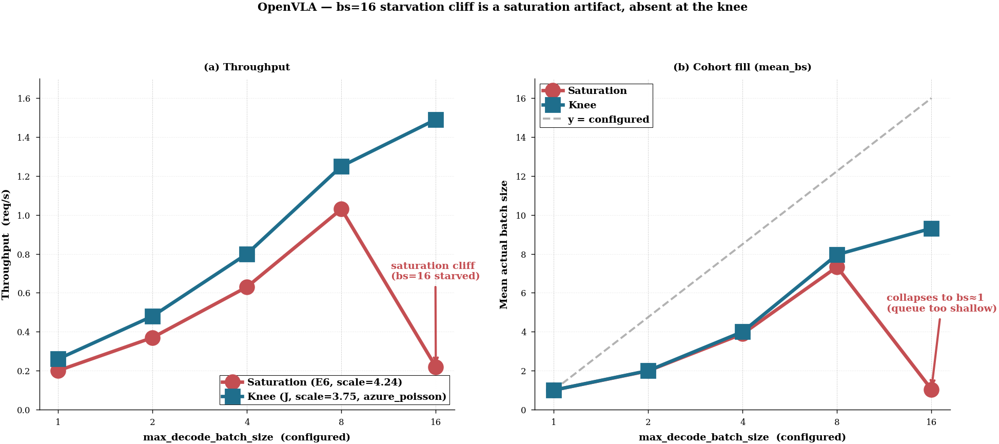

Direct overlay of F2 (saturation, scale=4.24) and F2-knee
(knee, scale=3.75) for OpenVLA. The bs=16 throughput cliff and the
corresponding mean_bs collapse only appear under deep saturation — at
the knee, the queue holds enough decode-ready requests to fill the
cohort. **Conclusion**: the cliff is a queue-depth artifact of
saturation, not a real scheduler limit. Generated by
[thesis_bs_cliff_compare.py](scripts/thesis_bs_cliff_compare.py).

### F5 — Route-mix divergence (§6.4)
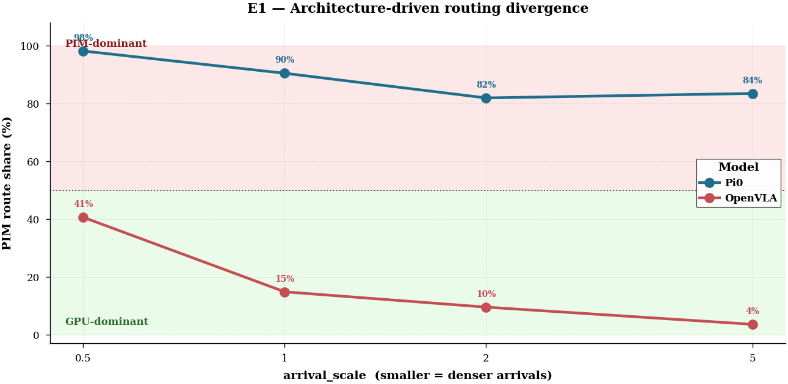

Pi0 stays **PIM-dominant** (98%→84%) across the entire arrival_scale
range; OpenVLA stays **GPU-dominant** (41%→4%). Same scheduler, opposite
routing decisions — architecture-driven.

### F6 — Roofline (§3)
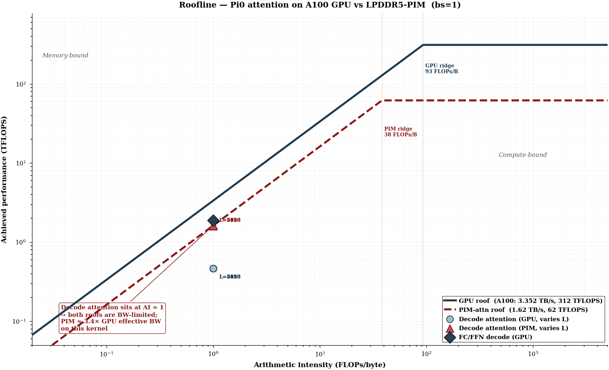

Decode attention sits at AI≈1 FLOPs/byte — both roofs are
BW-limited there. PIM's 1.62 TB/s sustained beats GPU's effective
~0.47 TB/s on the KV-bound attention kernel (≈3.4× advantage).

### F7 — Cost-model validation (§5)
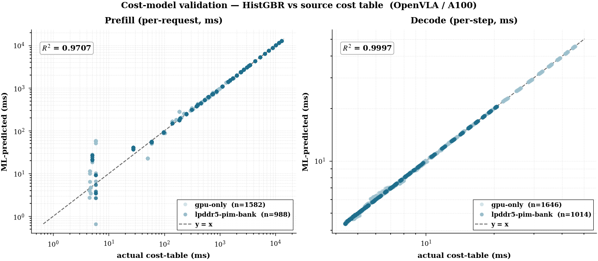

HistGBR cost model is a faithful surrogate of the dense cost table.
Decode R²=0.9997 (essentially perfect); prefill R²=0.971
(small scatter at small Lin where prefill time is sub-millisecond).

### F8 — KV allocation policy comparison (§6.2)
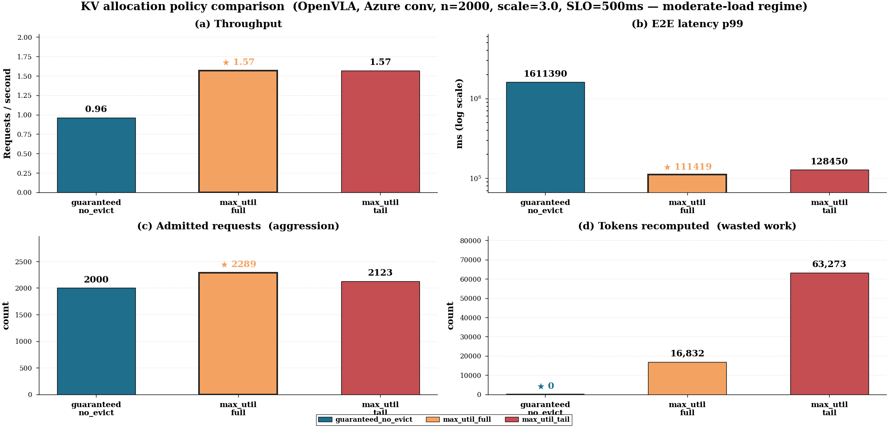

Three policies head-to-head on the **moderate-load regime** where the
policy choice actually matters — OpenVLA, Azure conv, n=2000,
arrival_scale=3.0, kv_pool=4 GiB, max_active=32, SLO=500ms
(`sweep_openvla_n2000_20260513_161108/05_slo500_max_util_full/` etc).

| Metric | guaranteed_no_evict | max_util_full | max_util_tail |
|---|---|---|---|
| Throughput | 0.96 req/s | **1.57 req/s** ★ | 1.57 req/s |
| E2E p99 | 1 611 390 ms | **111 419 ms** ★ | 128 450 ms |
| Admitted | 2 000 | **2 289** ★ | 2 123 |
| Tokens recomputed | **0** ★ | 16 832 | 63 273 |

Story: **`max_util_full` wins on every user-facing metric.** Chunked
admission + full-block eviction keeps the KV pool unblocked and admits
+14% more requests than gne, with throughput +63% and E2E p99 14×
lower (1.6M → 111k ms). `max_util_tail` matches throughput but fine-
grained tail-trim incurs ~10× more preemptions (2 933 vs 289) and
recomputes 3.8× more tokens, dragging E2E p99 ~15% worse than full.
gne trivially "wins" recomputation (zero preemption = zero recomp) but
its conservative admission leaves the pool half-empty under load, so
TTFT and E2E p99 explode into the minutes range.

This is why the thesis uses **`max_util_full + max_consecutive_decode_batches=4`**
as the operating point everywhere downstream of §6.2 (E5 main claim,
E6 batching, F full-19k).

> Note: under **deep saturation** (scale=1.0, e.g. E5), the three
> policies converge — the system is admission-bound regardless of
> eviction strategy and the differences collapse. The story above is
> the regime that decided the default.

### F9 — Peak-RPS knee curve (§6.1)
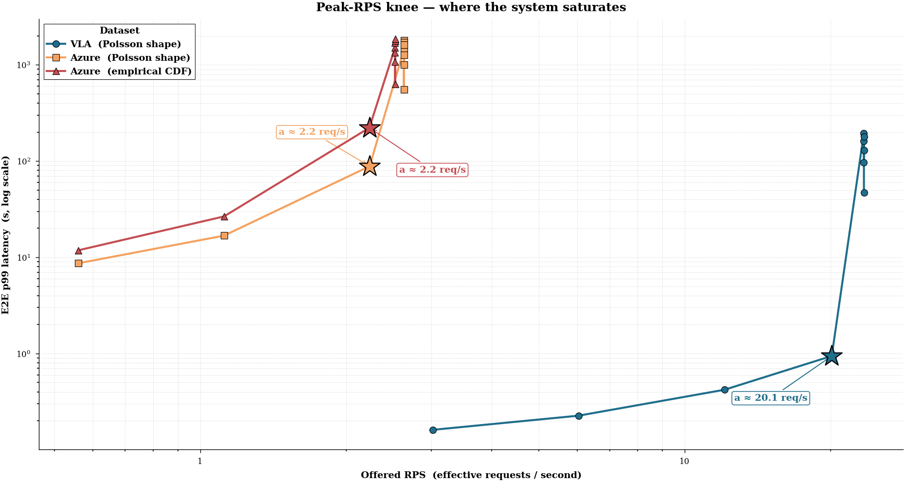

The knee marks the **peak RPS `a`** our system can sustain at p99-SLO:
beyond `a`, E2E p99 rises super-linearly. Three lines (one per
dataset), log-log axes, star annotation marks each dataset's `a`.

Measured values (Pi0, max_util_full, 8 GiB pool, bs=4, max_active=32,
A6000, sweep `rps_knee_pi0_20260529_224452`, 2026-05-30):

| Dataset | throughput ceiling | knee detected at | Notes |
|---|---|---|---|
| `vla_poisson` | **23.4 req/s** | **a ≈ 20.1 req/s** (scale=1.5, p99=943ms) | Short Lin (306) + short Lout (7); under SLO at offered ≤12 RPS. |
| `azure_poisson` | 2.63 req/s | **a ≈ 2.24 req/s** (scale=2.5, p99=88s) | Knee is the last point BEFORE the throughput ceiling; saturation cluster at 2.63 holds 7 cells. |
| `azure_empirical` | 2.53 req/s | **a ≈ 2.23 req/s** (scale=2.5, p99=222s) | Essentially identical knee to Poisson — shape variance doesn't move the elbow. |

**Headline findings**:

1. **9× gap between robotic and conversational** workloads on the
   same hardware (20.1 / 2.23). Dominated by mean Lout (7 vs 211) —
   decode steps per request drive everything.
2. **Heavy-tail Azure_empirical knees at the same RPS as Poisson**
   (2.23 vs 2.24). Shape variance moves the throughput ceiling
   slightly (~4%, 2.53 vs 2.63) but not the elbow itself. Practical
   implication: `azure_poisson` is a fine stand-in for the real
   Azure shape when measuring knees.
3. **Azure on Pi0 violates the 500ms SLO at every tested rate**.
   Even at 0.56 RPS, p99 = 8.6s. The SLO is fundamentally
   incompatible with Pi0's per-request decode time on Azure-length
   contexts. This is why the thesis comparison uses *relative*
   metrics (hybrid vs gpu-only) rather than absolute SLO compliance.

Methodology: see [docs/plan/rps_knee_finder.md](../docs/plan/rps_knee_finder.md).
Per-dataset figures F9a/b/c follow this combined view — each isolates
one workload for closer inspection of its own knee.

> ⚠️ **`a` is config-dependent.** The numbers in the table are for
> `(model=Pi0, mode=hybrid, policy=max_util_full, kv_pool=8GiB, bs=4)`.
> Different models or knobs shift the knee — OpenVLA at the Pi0-derived
> scale is already deep in saturation, so its own `a` is substantially
> lower. A separate OpenVLA knee-finder run is needed to characterize
> it; see [docs/plan/knee_scaled_experiments.md](../docs/plan/knee_scaled_experiments.md).

**Linear-axes variants (F9-lin, F9a-lin, …)**: same data with linear
RPS × p99 axes for an intuitive read of the elbow shape. The combined
view becomes a 3-panel layout (one subplot per dataset) because RPS
ranges differ ~10× across datasets and a single linear panel would
crush Azure into the leftmost sliver. The y-axis is auto-capped at
2.5–3× the knee p99 so the saturation cluster doesn't dominate. Use
`--linear` on `thesis_rps_knee.py` to regenerate.

### G — Main claim at the knee  (NEW, §6.5.0a)

**Per-model figures (preferred)**: each row × dataset is one (model,
dataset) tuple, rendered at *that model's* knee scale. Mixing models on
a single figure is misleading because Pi0 and OpenVLA have different
`a` values, so the same arrival_scale puts them in different regimes.

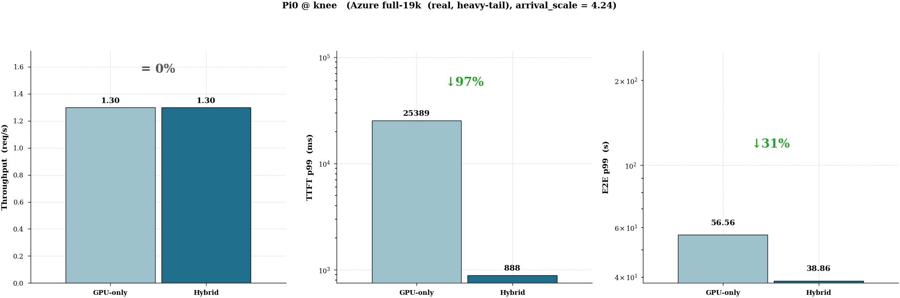
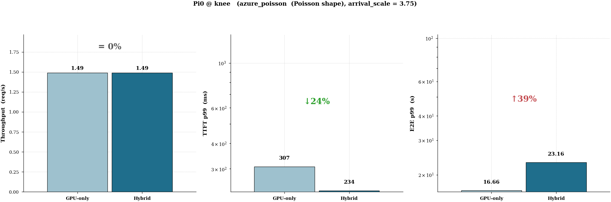

Pi0 at its own knee. Three metrics per figure (Throughput, TTFT p99,
E2E p99). On azure_full19k, hybrid wins all (TTFT ↓97%, E2E ↓31%). On
azure_poisson, hybrid wins TTFT (↓24%) but **loses E2E** (↑39%) — the
narrow Lin band removes the long-context regime where PIM dominates.

Per-model figures for `vla_poisson` and `azure_empirical` are pending
the jobs 13270157 / 13270158, and OpenVLA versions are blocked on the
OpenVLA knee-finder run (job 13269914) so the right scale can be
chosen. Regenerate with
[thesis_g_knee_per_model.py](scripts/thesis_g_knee_per_model.py)
`--auto` once those land.

**Legacy 2×2 layout (deprecated, kept for reference)**:
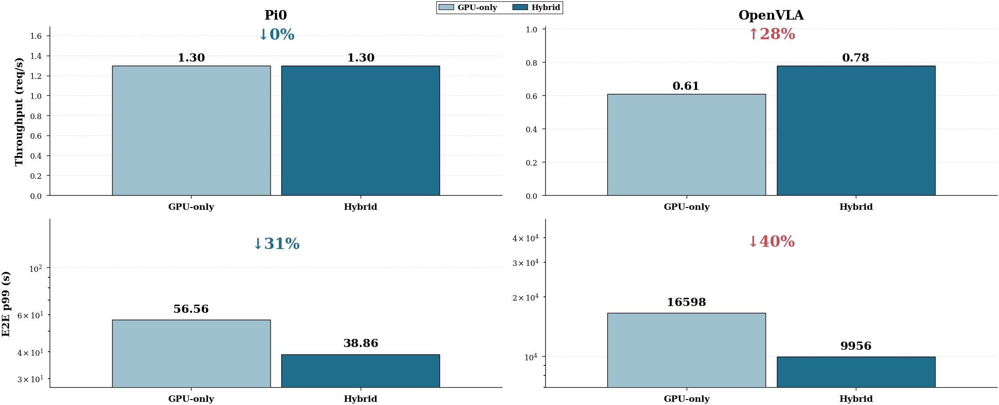
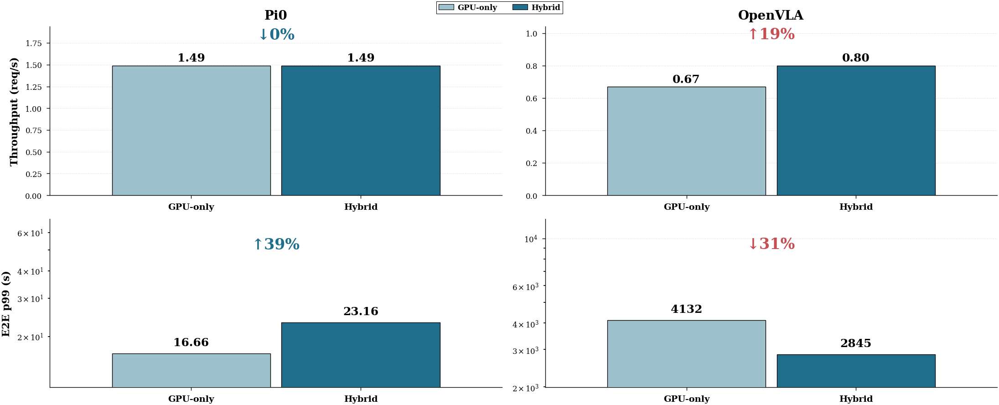

These mix Pi0 and OpenVLA on one figure at Pi0's scale — OpenVLA cells
are in deep saturation here, so the comparison isn't apples-to-apples.

### G-cmp — Pi0 cross-dataset comparison  (NEW)
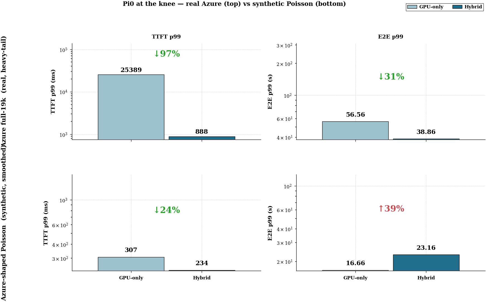

Pi0 only, both datasets stacked on rows. TTFT p99 + E2E p99 columns,
hybrid vs gpu-only bars per cell. The single-figure visualization of
the central knee finding: hybrid wins TTFT on both traces (↓97% on the
real Azure, ↓24% on Poisson), but only wins E2E on the heavy-tail Azure
(↓31%) — the smooth Poisson **inverts E2E** (↑39%). The
heavy-tail-dependence of the hybrid advantage is the load-bearing
thesis point here. Generated by
[thesis_g_dataset_compare.py](scripts/thesis_g_dataset_compare.py).

### K — Admission budget X at the knee  (NEW, null finding)
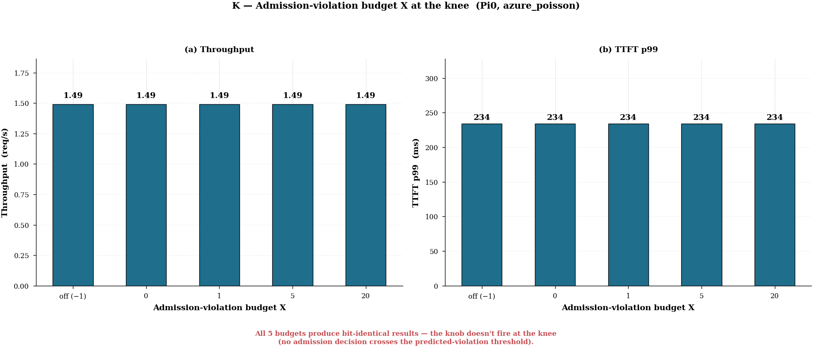

All 5 budgets {−1, 0, 1, 5, 20} produce bit-identical throughput
(1.49 req/s) and TTFT p99 (234 ms) — the X-budget control doesn't fire
at the knee. Combined with Phase C's "wrong-direction at saturation"
result, this is a clean conclusion: the X-budget knob as currently
formulated is inert across both regimes. Source:
`k_knee_admit_azure_poisson_20260530_175019`, generated by
[thesis_k_admission_null.py](scripts/thesis_k_admission_null.py).

### F12 — RPS-over-time before vs after scaling to `a` (§6.1)
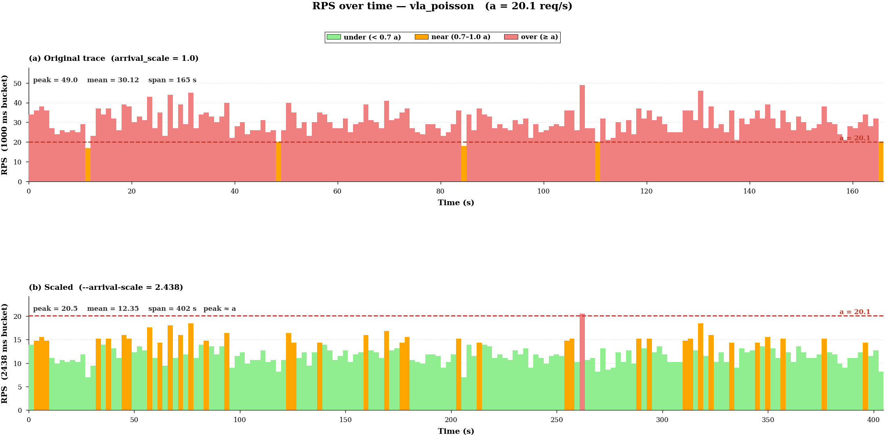
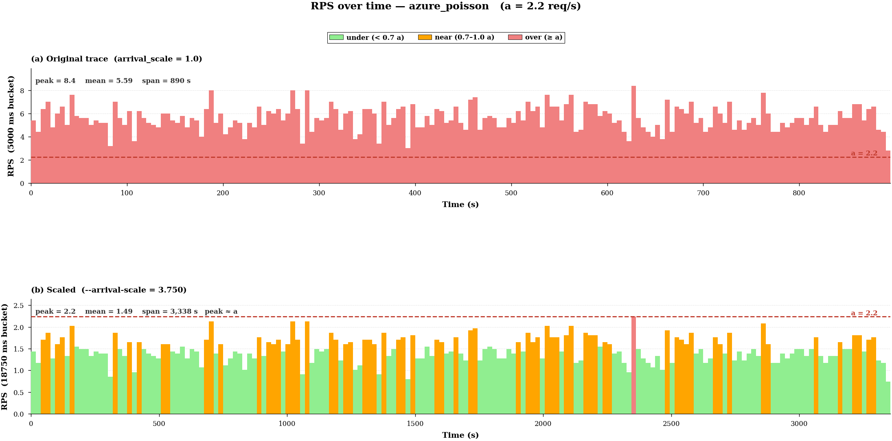
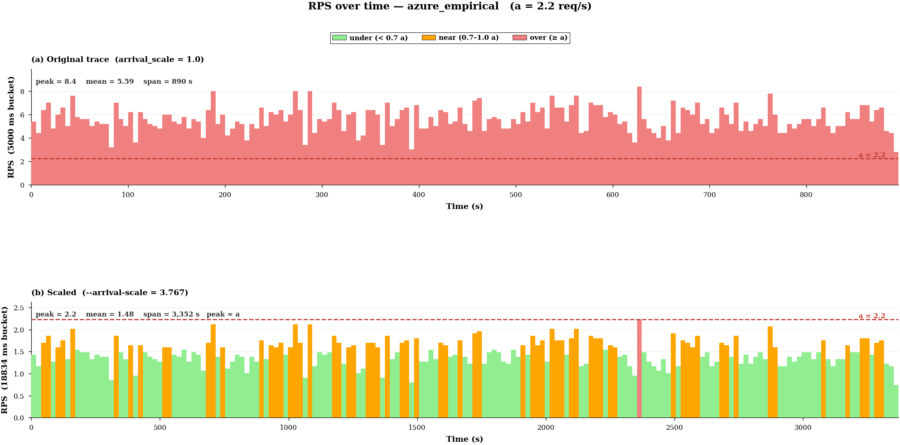
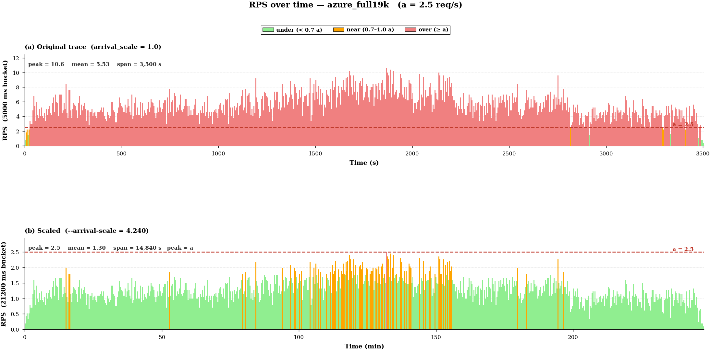

Two-panel figures showing each trace's instantaneous RPS **before**
scaling (arrival_scale=1.0) and **after** scaling so the peak
instantaneous RPS touches `a`. Bars are colored by their relation to
`a`: green = under, amber = near, red = over.

**Equal-width bars**: the bottom panel's bucket size is auto-scaled
by the same factor as the timestamps so both panels render the same
number of bars (e.g. azure_full19k: top = 5 s buckets, bottom =
21.2 s buckets). The y-axis label shows the bucket size explicitly.
Without this fix the bottom panel's bars would be `scale×` thinner
because the time-axis extent grows proportionally.

| Dataset | Original peak | Scale to touch `a` | a (req/s) |
|---|---|---|---|
| `vla_poisson` | 49.0 RPS | ÷2.44 (slow down) | 20.1 |
| `azure_poisson` | 8.4 RPS | ÷3.19 (rendered) or ÷3.75 with knee a=2.24 | 2.24 (knee) / 2.63 (ceiling) |
| `azure_empirical` | 8.4 RPS | ÷3.32 (rendered) or ÷3.77 with knee a=2.23 | 2.23 (knee) / 2.53 (ceiling) |
| **`azure_full19k`** (real Azure) | 10.6 RPS | ÷4.24 (rendered) — placeholder until full19k sweep | 2.5 (placeholder) |

The F12 figures are currently rendered with the previous ceiling-based `a` (2.63 / 2.53). After Phase 2's saturation-aware knee detection, the **true elbow** is at 2.24 / 2.23 — re-render with `--a-rps 2.24` (or `2.23`) for the knee-correct version.

**Why both VLA and Azure need slowing down**: each preset was
generated at a rate (30 Hz, 5.5 Hz) chosen so that **the base trace
already saturates the system**. The "scaled" panel shows the regime
where the simulator can actually serve all requests at their SLO —
green dominates, with occasional amber/red excursions where the
trace's bursty Poisson arrivals briefly touch `a`. That's exactly the
operating point we want for the thesis main claim.

The scale factor IS the `--arrival-scale` you would pass to the
runner to put the trace at the knee. The bottom-panel labels show
exactly this number.

### F13 — Full-trace dashboard (§6.5, ThrottLLM-style)

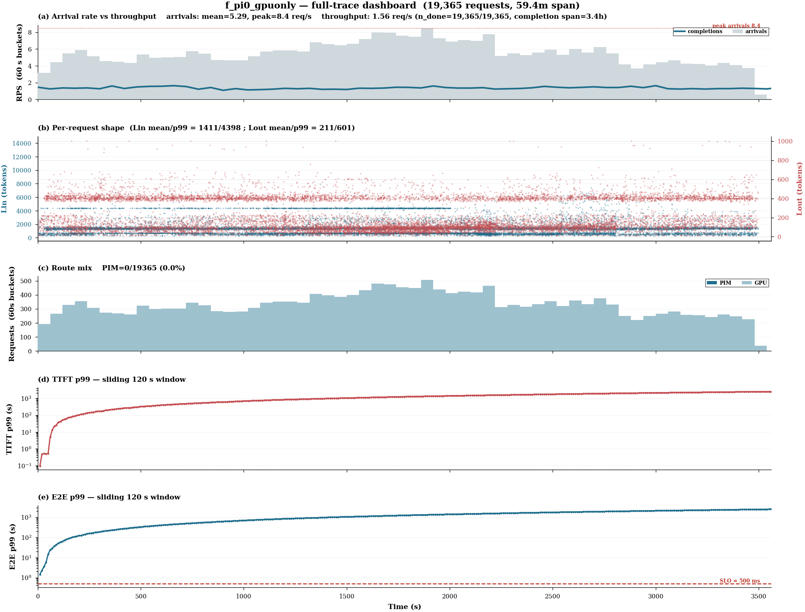
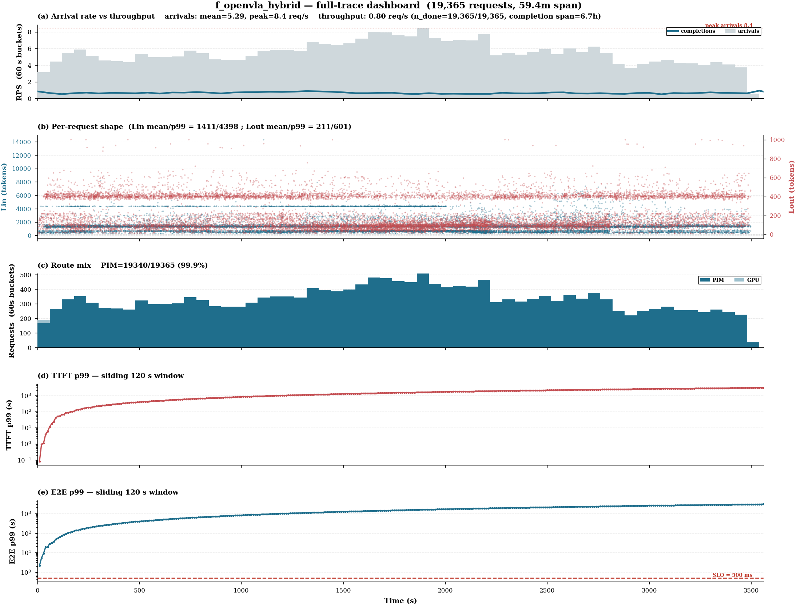
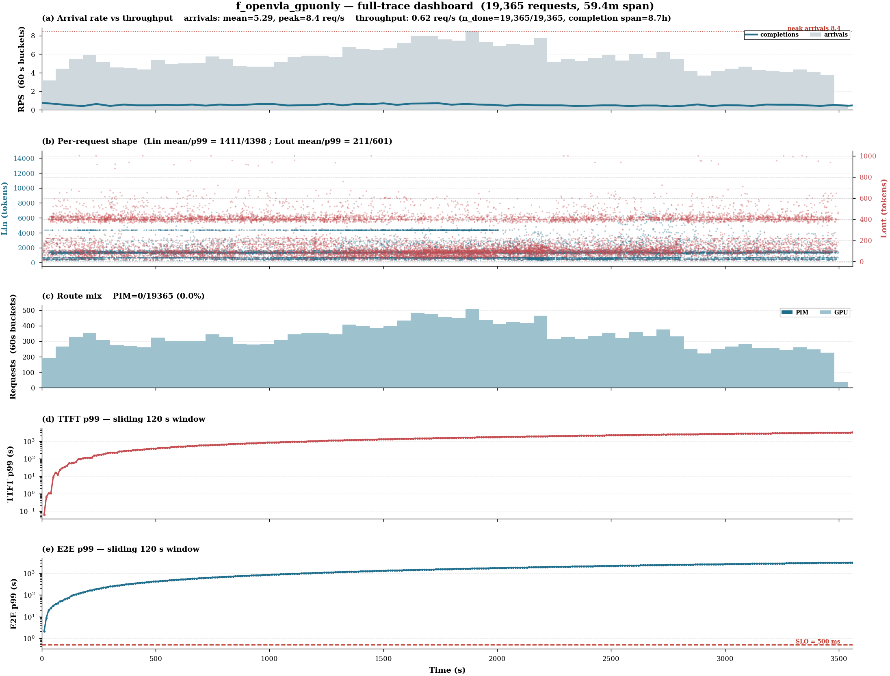

5-panel dashboard, one figure per F cell, all sharing a common
arrival-time x-axis:

  (a) **Arrival rate vs throughput** — light-grey bars are arrivals
      per 60 s bucket (identical across all cells, it's the input
      trace); dark teal line is **completions per bucket** (the
      system's response, cell-dependent). The gap between them is
      the queue-growth signature. Subtitle reports `arrivals: mean,
      peak` and `throughput: req/s` matching `policy_compare_summary.txt`.
  (b) **Per-request shape** scatter — Lin (left axis, teal) +
      Lout (right axis, rust). Reveals Azure's heavy tail visually
      (Lin reaches 14k tokens at p99).
  (c) **Route mix** per bucket — stacked PIM (teal) vs GPU (light
      teal) bar. For Pi0 hybrid: 99.9% PIM throughout; for gpu-only:
      100% GPU.
  (d) **TTFT p99** over a sliding 120 s window, log scale.
  (e) **E2E p99** over the same window, with SLO line.

Per-cell throughput + completion-span across the F sweep:

| Cell | Throughput | Completion span |
|---|---|---|
| Pi0 hybrid | 2.54 req/s | 2.1 h |
| Pi0 gpu-only | 1.56 req/s | 3.4 h |
| OpenVLA hybrid | 0.80 req/s | 6.7 h |
| OpenVLA gpu-only | 0.62 req/s | 8.7 h |

The arrival window is 59 minutes for all cells, but the drain takes
2–8× longer because the input rate (5.29 RPS) exceeds the system's
`a` for all four configurations. Hybrid drains ~1.6× faster than
gpu-only on the same model — that's the F1+ headline result
expressed in the time domain.

The dashboards make the saturation story visible directly: even at
Azure's modest mean rate (5.29 RPS), Pi0's `a ≈ 2.5 RPS` means **the
queue grows monotonically** through the entire 1-hour trace, with p99
climbing from milliseconds to 1000+ seconds. The SLO line at 500 ms
is crossed within the first minute and never recovered.

Compare hybrid (F13a) vs gpu-only (F13b) — both show the same
saturation pattern, but the gpu-only curve sits ~5× higher
throughout the trace, exactly the gap that F1+ measured (−53% E2E
p99 reduction from hybrid).

This figure family is the natural place to land in §6.5 when
discussing why the simulator's absolute p99 values are
saturation-dominated and why relative comparison is what the thesis
claim rests on.

### F10 — Trace timeline (§6.1)
**Real workload (reference):**

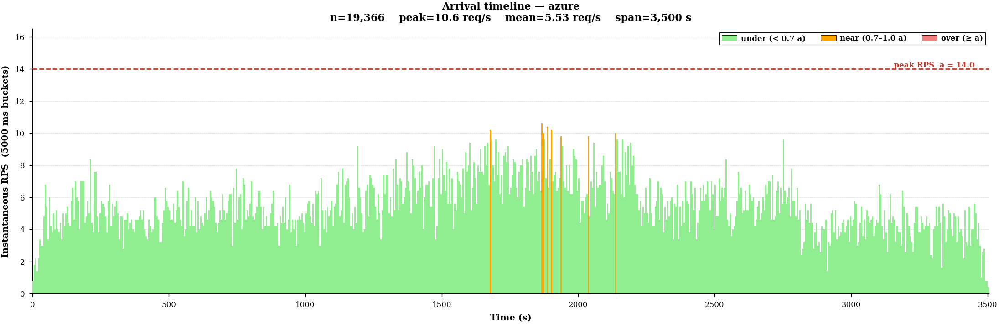

**Three synthetic datasets used in the knee sweep:**

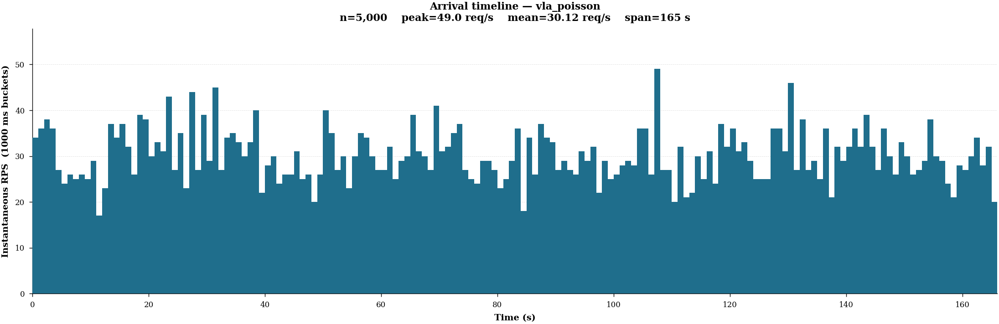

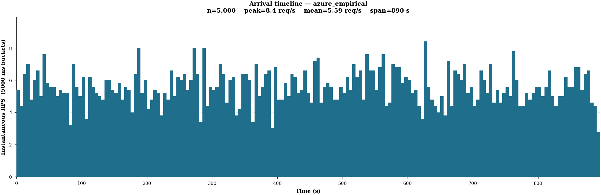

Per-bucket instantaneous RPS over time. The Azure trace (real, 5.5
req/s mean) is the reference; the three synthetic datasets below it
are what `tools/run_rps_knee_sweep.sbatch` actually sweeps:

| Dataset | Shape source | Lin std | Use |
|---|---|---|---|
| `vla_poisson` | Poisson(λ=306/7) | 18 | Robotic VLA — short / dense, 30 Hz |
| `azure_poisson` | Poisson(λ=1155/211) | 34 | Azure-mean shape with narrow Poisson |
| `azure_empirical` | empirical CDF (19k Azure) | **1144** | Azure heavy-tail preserved |

`azure_empirical` is the most realistic Azure analogue — Lin std=1144
vs Azure's 1109, p99=4141 vs 4142. `azure_poisson` keeps the same mean
but with a ~30× tighter distribution, useful for isolating
**rate-versus-shape** effects: comparing `azure_poisson` and
`azure_empirical` head-to-head shows what changes when only the shape
distribution is varied (same arrival pattern, same mean Lin/Lout).

All three timelines hit the placeholder `a=14` line at different
moments — once the knee sweep returns the measured `a`, this line
will be updated and the bars re-colored under/near/over.

### F11 — Per-request shape over time (§6.1)
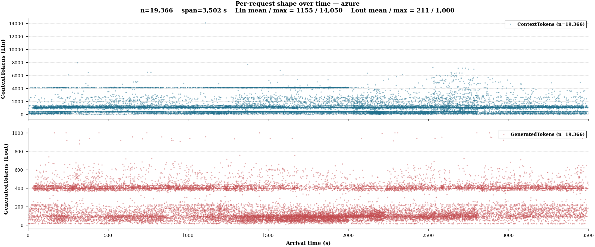
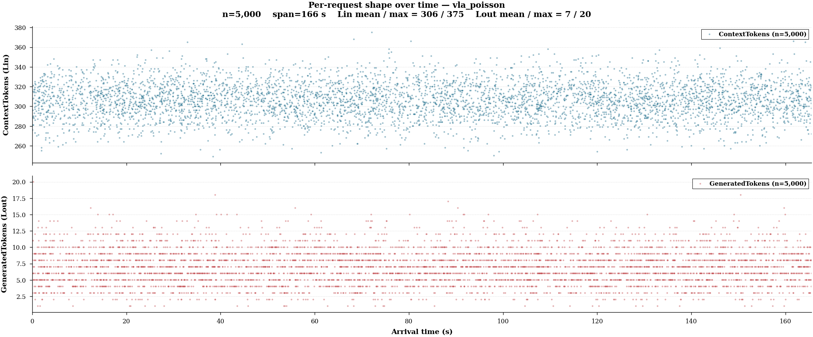
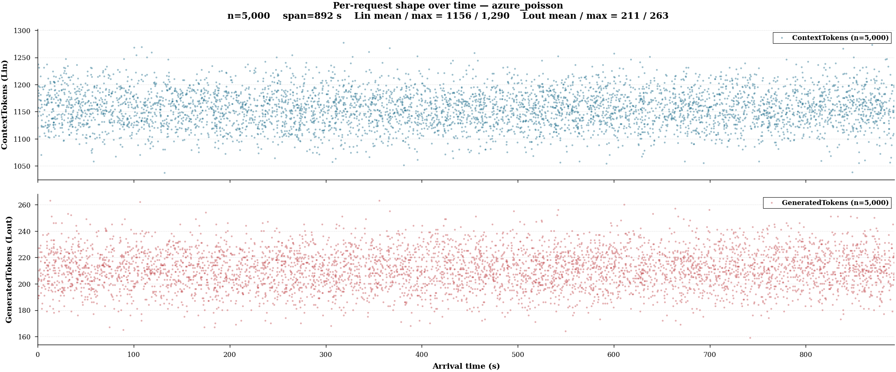
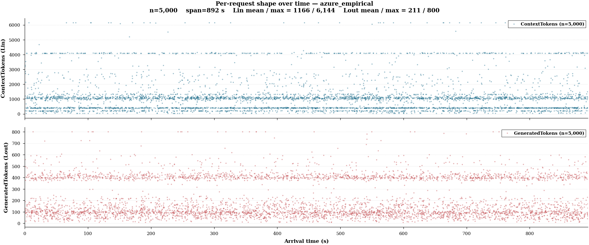

Per-request (arrival_time, ContextTokens) and
(arrival_time, GeneratedTokens) scatters. Distinct from F10 (which
shows arrival RATE over time); F11 shows SHAPE over time and makes
the heavy-tail vs Poisson comparison visible at a glance:

- **Azure (real)** — Lin spans 2 → 14 050 with visible clusters; Lout
  spans 7 → 1 000.
- **vla_poisson** — narrow band Lin ≈ 255 – 348, Lout ≈ 1 – 20.
  Per-request shape is essentially homogeneous (Poisson(λ=306/7)
  std ≈ √λ).
- **azure_poisson** — narrow band Lin ≈ 1 040 – 1 290 around mean
  1 156. **Same mean as Azure but Poisson std collapses the
  distribution** to within ±5%.
- **azure_empirical** — restores the vertical spread: Lin reaches
  6 144 (clip), Lout reaches 800. Visibly matches Azure's heavy tail
  while keeping the lower 5.5 Hz arrival rate.

The visual contrast between `azure_poisson` and `azure_empirical` is
the headline of this figure family: same arrivals, same mean shape,
completely different tail behavior — and that tail is what drives the
cost-model into higher Lin / Lout grid cells and ultimately into the
saturation regime.

## Reference style anchor

The figures use a `script_configs.parse_results`-style polished aesthetic
adapted to our domain. The original reference figure (P0_single_detailed.py
from `/home/okan/plotting_examples/`) was reproduced locally with dummy data
to anchor the style choices:

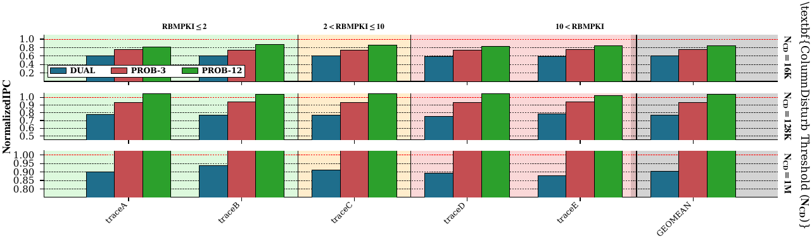

Run [examples_test/reproduce_P0_with_dummy.py](examples_test/reproduce_P0_with_dummy.py)
to regenerate this reference.
